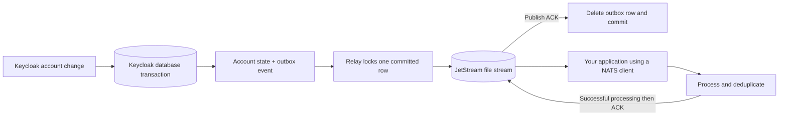

# Keycloak → NATS durable events

A Java 21 Keycloak event listener that durably publishes events to NATS JetStream through a transactional PostgreSQL outbox. Account creation, disablement, deletion, login, login failures, logout and other events emitted by Keycloak use the same pipeline. An optional receiver example demonstrates transactional deduplication.

Source: [gbeaule/keycloak-nats-durable](https://github.com/gbeaule/keycloak-nats-durable). Maven artifacts use the group `io.github.gbeaule`, and Java packages use the prefix `io.github.gbeaule.keycloaknats`.

**Delivery is at least once.** Receiving applications use the event ID to deduplicate repeated deliveries. Redelivery after a missing acknowledgement necessarily permits repeated delivery. The optional example demonstrates an inbox and database effect committed together; broker deduplication alone cannot make an arbitrary downstream side effect happen exactly once.

The extension uses **Keycloak's existing PostgreSQL database and connection pool**. It adds an outbox table; it does not require another database instance or separate database credentials. Users receive standard NATS JetStream messages in their own applications, using any compatible NATS client. The optional `consumer-example` demonstrates acknowledgements and deduplication in a separate database; it is not part of provider installation and does not require users to modify this repository.

Compatibility targets: Keycloak **26.6.4 / 26.7.4**, PostgreSQL **14–18** within the selected Keycloak version's support policy, NATS Server **2.15.0**, jnats **2.26.3**, Java **21**, Maven **3.9+**. PostgreSQL **18.6** is the default demo/full-test baseline, not a required major version. The accepted architecture uses Keycloak's documented event-listener and custom JPA registration APIs. See [the compatibility and upgrade policy](docs/compatibility.md) for exact test coverage and the limitations of these upstream APIs.

## Guarantees



* For events selected by the capture policy, the account change and event are committed together. A capture failure marks the Keycloak transaction rollback-only; Keycloak otherwise catches listener exceptions. NATS can be unavailable while account operations continue and events accumulate in PostgreSQL.
* The relay publishes only committed rows, and deletes a row only after a successful publish acknowledgement from the configured stream. PostgreSQL row locks with `SKIP LOCKED` coordinate multiple Keycloak nodes without leases or clock-based ownership. A dead process releases its locks through database connection recovery.
* A crash between publish and outbox commit can republish the same ID. `Nats-Msg-Id` deduplicates inside the stream's rolling window. Receivers handle duplicates outside that window and after a lost processing ACK. The example demonstrates a permanent inbox for this purpose.
* Consumers use explicit acknowledgements, a durable name and unlimited redelivery. Workers for one application share its durable name and deduplication state. Only acknowledge after successful processing; the example uses `ackSync`.
* Events are retried indefinitely with bounded exponential backoff and jitter. No outbox expiry, retry-count deletion, automatic purge, or silent dead-letter drop is implemented. Stream expiry and lossy eviction policies are rejected. Full streams push back into the database.

These guarantees cover selected events that reach this listener in a committed Keycloak database transaction. They require durable storage and the listener to be enabled. They do not cover external LDAP/IdP changes, direct SQL edits, imports or custom extensions that emit no event, a request killed before it reaches the event emitter, loss of every durable replica, or an external mutation outside Keycloak's database transaction. A rolled-back success operation has no success event. Keycloak error events can be emitted in their own transaction.

Events are **not globally or per-user ordered** across retries and concurrent nodes. Per-user ordering is feasible with coordinated capture sequences, publication and consumer processing; it is not currently a setting. See [the ordering design and tradeoffs](docs/ordering.md). `userEnabled` is observed state, not a transition or a monotonically increasing version. For a current-state authorization projection, reconcile with Keycloak; do not let an older enable/update message undo a later deletion or disablement.

## Build and test

```sh
python3 scripts/validate.py        # local/PR checks, including Python validation tooling
mvn -B -ntp verify                 # unit tests + packaged JARs
mvn -B -ntp -Pintegration verify   # full suite; a running Docker engine is required
```

Use `python scripts/validate.py` on Windows. [Local validation and CI](docs/ci.md) documents the
container, compatibility-matrix and security commands. PRs run quick checks; the expensive matrix
runs on changes merged/pushed to `main` and on manual requests.

Open the root `pom.xml` in IntelliJ, select a Java 21 project SDK and Java 21 Maven runner, and reload Maven. The integration profile intentionally fails if Docker is unavailable; it does not silently skip tests.

Check `mvn -version` as well as `java -version`: Maven can use a different JDK through `JAVA_HOME`. On this Windows workspace, IntelliJ supplies a usable Java 21 runtime:

```powershell
$env:JAVA_HOME = 'C:\Program Files\JetBrains\IntelliJ IDEA 2025.3.4\jbr'
mvn -B -ntp -Pintegration verify
```

Java follows **Google Java Style**, including mandatory braces, explicit imports and two-space indentation. Spotless uses Google Java Format; Checkstyle applies its full Google ruleset to production and test sources and fails on warnings. Both run during `verify`; use `mvn spotless:apply` after edits. See [the style configuration and IntelliJ workflow](docs/code-style.md).

The installable JAR is `extension/target/keycloak-nats-durable-1.0.0-SNAPSHOT.jar`. NATS and its cryptographic implementation are isolated inside the provider JAR; Keycloak libraries remain provided by the server. The runnable example is `consumer-example/target/consumer-example-1.0.0-SNAPSHOT.jar`.

The integration suite uses real PostgreSQL, NATS and Keycloak containers and tests account lifecycle events, failed logins, outbox rollback, stream overflow, unsafe configuration, missing consumer ACKs, database inbox atomicity, concurrent duplicate processing, broker outages, hard Keycloak restarts, two Keycloak nodes, and process death after broker acceptance before outbox commit. Logs and JUnit reports are under `integration-tests/target/`; unit reports are under `extension/target/surefire-reports/`.

The [verification record](docs/testing.md) records test results and their limits. [CI security](docs/ci-security.md) explains why PR builds execute untrusted code, where they run, and the protections required at repository level.

The [2026-09-27 production readiness review](docs/production-readiness-2026-09-27.md) records confirmed
defects, fixes, regression coverage and the remaining deployment acceptance requirements.

The additional failure suites exercise live capture-policy replacement, mounted mutual TLS, certificate rejection, NATS leader and quorum loss, surviving Keycloak-node recovery, and retry storage behavior. The [external listener comparison](docs/listener-comparison.md) explains why direct webhooks cannot replace the transactional outbox with equivalent guarantees.

## Local demonstration

```sh
mvn -B -ntp package
docker compose up --build -d
```

Open `http://localhost:8080`, sign in as `admin` / `admin-local-only`, select `durable-demo`, and disable or delete the `demo` user. Authentication can also be exercised with `demo` / `demo-local-only` and the public direct-grant client `demo-app`. The consumer automatically records received events in its database:

```sh
docker compose exec postgres psql -U consumer -d consumer -c 'SELECT * FROM knd_effects ORDER BY applied_at'
docker compose logs consumer keycloak
docker compose down
```

The named volumes preserve state across `down` and `up`. This compose stack is a local demo with one NATS node, plaintext networking and demonstration credentials, bound to loopback on the host. Production setup is described in [operations](docs/operations.md). Provisioning creates the stream and consumer; it does not migrate an existing deployment to different retention settings.

## Install into Keycloak

1. Back up the Keycloak database. Copy the extension JAR to `$KEYCLOAK_HOME/providers/` and run `kc.sh build --db=postgres`.
2. Provision the stream and durable consumer using the example's `provision` command, or equivalent NATS administration tooling. The publisher itself has no need for stream-create or stream-update privileges.
3. Set `KND_NATS_URL`, credentials and the settings below. Start Keycloak. The Liquibase migration adds only `KC_NATS_OUTBOX` and its index, with no foreign keys to users or realms, so deletion cannot erase pending events.
4. For **each realm**, add `nats-durable` to Realm settings → Events → Event listeners, preserving other listeners. The demo realm shows the JSON equivalent. Keycloak's “Save events” and admin “Include representation” are not required. The provider never forwards raw representations, even if enabled.
5. Verify that a test account operation reaches the consumer, and monitor both the outbox and JetStream backlog. Keycloak readiness alone does not prove that event delivery is caught up.

All Keycloak nodes sharing the database must install the same provider and use the same stream, subject prefix and credentials. Keep the relay installed and running until any existing backlog has drained before removing the provider or its table. Re-enabling a listener cannot recover events produced while it was disabled.

This works with existing PostgreSQL-backed installations: add the JAR, rebuild/restart, let the extension migration run, and enable the listener. It is not hot deployment. Other Keycloak database engines require validation before use; the demo is not a requirement to provision a new Keycloak/database. See [cluster and installation details](docs/compatibility.md#existing-installations-and-clusters).

## Configuration

Environment variables are convenient in containers; matching Keycloak provider configuration keys (lowercase with hyphens, for example `nats-url`) take precedence.

| Variable | Default | Meaning |
|---|---|---|
| `KND_NATS_URL` | `nats://localhost:4222` | Comma-separated `nats://` or `tls://` servers; no inline credentials |
| `KND_STREAM` | `KEYCLOAK_EVENTS` | Expected stream; every publish verifies it |
| `KND_SUBJECT_PREFIX` | `keycloak.events` | Must exactly match the stream's sole subject `<prefix>.>` |
| `KND_MIN_REPLICAS` | `3` | Minimum stream replicas; single-node demo explicitly uses `1` |
| `KND_CREDENTIALS_FILE` | unset | Mounted NATS JWT/NKey credentials file |
| `KND_TOKEN` | unset | Alternative NATS token; mutually exclusive with credentials file |
| `KND_TIMEOUT_MS` | `2000` | Connection and individual JetStream request timeout |
| `KND_POLL_MS` | `500` | Minimum scan delay when no full batch is available |
| `KND_IDLE_POLL_MAX_MS` | `5000` (at least `KND_POLL_MS`) | Maximum delay between idle/recovery scans; local commits wake the relay immediately |
| `KND_BATCH_SIZE` | `64` | Maximum individual transactions per relay poll |
| `KND_RELAY_WORKERS` | `1` | Concurrent relay workers per node, 1–16; budget one database connection and NATS connection per active worker |
| `KND_RETRY_INITIAL_MS` | `1000` | Initial retry ceiling, with 50–100% jitter |
| `KND_RETRY_MAX_MS` | `60000` | Maximum retry ceiling |
| `KND_MAX_PAYLOAD_BYTES` | `65536` | Capture byte limit; exceeding it rolls back the transaction |
| `KND_FILTER_FILE` | unset (capture all) | Mounted JSON capture policy, reloaded without restart |
| `KND_FILTER_RELOAD_MS` | `1000` | Policy polling interval; 100–60000 milliseconds |
| `KND_TLS_CA_FILE` | unset (JVM roots) | PEM CA bundle; requires all `tls://` servers |
| `KND_TLS_CERT_FILE` | unset | PEM client certificate chain for mutual TLS |
| `KND_TLS_KEY_FILE` | unset | Paired unencrypted PEM client key: PKCS#8, RSA PKCS#1 or EC SEC1 |

TLS is optional: use `nats://` servers with no `KND_TLS_*` settings for plaintext, or `tls://` on every seed to enable TLS. With TLS enabled, both certificate trust and hostnames are verified. Publisher, provisioner and consumer accept the same mounted PEM files, with private-key parsing handled by Bouncy Castle. Keep credentials in mounted secrets rather than command lines or source control. See [capture filters, TLS mounts and HA deployment](docs/configuration.md), including [disabled-only](config/events-disabled-only.json) and [all-events](config/events-all.json) policies. Invalid initial filters fail startup; invalid reloads keep the last valid policy. Reloads never discard already captured events.

The capture policy is also optional; without it, all emitted events are captured. It supports realm
IDs, client IDs, outcomes, NATS subject patterns, user event types and admin operations. JetStream
WorkQueue retention keeps messages even with no consumer defined, so subject subscriptions alone do
not remove irrelevant events. Use [capture filtering](docs/configuration.md#choose-events-before-storing-them)
to avoid accepting types that the deployment will never need. Backlog capacity, thresholds and
monitoring belong to the deployment owner.

The outbox is initialized and upgraded automatically through the packaged Liquibase changelog; it needs no separate `initdb` folder. Confirmed delivery immediately deletes its row. PostgreSQL autovacuum reclaims reusable space, and retries only update metadata. See [database initialization and retention](docs/database.md) for capacity planning and safe cleanup boundaries.

## Event contract and consumer

Subjects are `<prefix>.<realmToken>.user.<event>` or `<prefix>.<realmToken>.admin.<resource>.<operation>`. The realm token is base64url without padding of the UTF-8 realm ID; built-in resource/event/operation names are lowercased. For example, `keycloak.events.ZGVtbw.admin.user.update` routes USER updates for realm ID `demo`. Inspect `outcome` and `userId` before acting.

The [complete event guide](docs/events.md) includes field-by-field shapes, twelve JSON examples, every upstream enum, subject filters, privacy boundaries and migration notes for the new admin resource token.

See [the versioned JSON schema](schemas/event-v1.schema.json). A disabled user is a successful `io.keycloak.admin.update` event with `data.userEnabled: false`. The flag is obtained from the user model within the original transaction; it does not depend on an admin representation. A direct deletion includes the deleted user's ID from the resource path. Nested paths such as `users/ID/role-mappings` are not mislabeled as direct account changes. Email, username, IP address, credentials, arbitrary attributes and event details are omitted; realm/user/client identifiers and admin resource paths still require appropriate access controls.

```sh
# Set KND_NATS_URL, KND_MIN_REPLICAS and credentials for your deployment first.
java -jar consumer-example/target/consumer-example-1.0.0-SNAPSHOT.jar provision
# Also set KND_CONSUMER_DB_URL, KND_CONSUMER_DB_USER, KND_CONSUMER_DB_PASSWORD.
java -jar consumer-example/target/consumer-example-1.0.0-SNAPSHOT.jar migrate
java -jar consumer-example/target/consumer-example-1.0.0-SNAPSHOT.jar
```

`KND_CONSUMER` defaults to `auth-worker`; `KND_STREAM_MAX_BYTES` defaults to 1 GiB when provisioning. The example defaults to WorkQueue retention: multiple instances share one durable consumer, and ACK removes a message. For independent applications that each need all events, provision a Limits stream and one durable/inbox namespace per application instead. Disable expiry, keep DiscardNew, and explicitly manage retention only after all applications have processed the retained history.

The consumer has configurable database/processing deadlines, progress ACKs, periodic status reports
and an optional `/metrics` and `/health/ready` endpoint. Failed messages retry by default. Explicit
subject-scoped quarantine and dropping policies, including disabled-by-default age shedding, are
described in [consumer operations](docs/consumer.md). Automatic schema creation is opt-in outside
Compose. The default demo/test database is PostgreSQL 18.6; supported existing databases may stay on
their current major version. Moving a 17.x volume to 18 requires an
[explicit major-version upgrade](docs/postgres-upgrade.md).

`InboxProcessor.recordEffect` only writes the demo's effect ledger so its durability can be tested. It is not an extension point users must edit. Receiving applications subscribe to JetStream, process the CloudEvent and acknowledge it after success. They own their business logic and deduplication. The example illustrates one approach: commit an inbox ID and a database effect in one transaction. External HTTP/email effects need their own idempotency or transactional outbox strategy; broker delivery alone cannot make them exactly once.

Design decisions and reviewed upstream sources: [architecture and research](docs/architecture.md). Capacity, alerting, failure diagnosis and recovery: [operations](docs/operations.md).

Production tools and evidence: [monitoring](docs/monitoring.md),
[throughput measurements](docs/performance.md), [recovery drills](docs/recovery-drills.md), and
[release/SBOM procedures](docs/releases.md). The [security baseline assessment](docs/security-findings.md)
records owner-accepted upstream image findings. The security gate still checks dependencies shipped
by this project; upstream server images remain unchanged.
