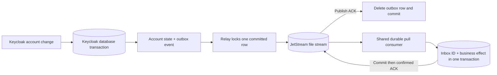

# Keycloak → NATS durable events

A Java 21 Keycloak event listener with a transactional PostgreSQL outbox, a JetStream relay, and an example consumer with a transactional inbox. Account creation, disablement, deletion, login, login failures, logout and other events emitted by Keycloak use the same pipeline.

**Delivery is at least once. Database business effects can be applied once using the included consumer inbox.** Redelivery after a missing acknowledgement necessarily permits repeated delivery. Broker deduplication alone cannot make an arbitrary downstream side effect happen exactly once.

Baseline: Keycloak **26.7.4**, PostgreSQL **17**, NATS Server **2.12.8**, jnats **2.26.3**, Java **21**, Maven **3.9+**. Other Keycloak versions and database engines are not claimed as supported. Keycloak's custom JPA SPI is an unsupported API; run the full suite before any Keycloak upgrade.

## Guarantees



* The account change and event are committed together. A capture failure marks the Keycloak transaction rollback-only; Keycloak otherwise catches listener exceptions. NATS can be unavailable while account operations continue and events accumulate in PostgreSQL.
* The relay publishes only committed rows, and deletes a row only after a successful publish acknowledgement from the configured stream. PostgreSQL row locks with `SKIP LOCKED` coordinate multiple Keycloak nodes without leases or clock-based ownership. A dead process releases its locks through database connection recovery.
* A crash between publish and outbox commit can republish the same ID. `Nats-Msg-Id` deduplicates inside the stream's rolling window. The consumer's permanent inbox covers repeats outside that window, concurrent redelivery, and crashes after business commit but before ACK.
* Consumers use explicit acknowledgements, a durable name and unlimited redelivery. Workers for one application share that durable name and the same inbox database. Only acknowledge after successful processing; the example uses `ackSync`.
* Events are retried indefinitely with bounded exponential backoff and jitter. No outbox expiry, retry-count deletion, automatic purge, or silent dead-letter drop is implemented. Stream expiry and lossy eviction policies are rejected. Full streams push back into the database.

These guarantees cover events that reach this listener in a committed Keycloak database transaction. They require durable storage and the listener to be enabled. They do not cover external LDAP/IdP changes, direct SQL edits, imports or custom extensions that emit no event, a request killed before it reaches the event emitter, loss of every durable replica, or an external mutation outside Keycloak's database transaction. A rolled-back success operation has no success event. Keycloak error events can be emitted in their own transaction.

Events are **not globally or per-user ordered** across retries and concurrent nodes. `userEnabled` is observed state, not a transition or a monotonically increasing version. For a current-state authorization projection, reconcile with Keycloak; do not let an older enable/update message undo a later deletion or disablement. The example records an effect ledger rather than building an unsafe ordered projection.

## Build and test

```sh
mvn -B -ntp verify                 # unit tests + packaged JARs
mvn -B -ntp -Pintegration verify   # full suite; a running Docker engine is required
```

Open the root `pom.xml` in IntelliJ, select a Java 21 project SDK and Java 21 Maven runner, and reload Maven. The integration profile intentionally fails if Docker is unavailable; it does not silently skip tests.

Check `mvn -version` as well as `java -version`: Maven can use a different JDK through `JAVA_HOME`. On this Windows workspace, IntelliJ supplies a usable Java 21 runtime:

```powershell
$env:JAVA_HOME = 'C:\Program Files\JetBrains\IntelliJ IDEA 2025.3.4\jbr'
mvn -B -ntp -Pintegration verify
```

Java formatting is checked during `verify`; use `mvn spotless:apply` after edits.

The installable JAR is `extension/target/keycloak-nats-durable-1.0.0-SNAPSHOT.jar`. NATS and its cryptographic implementation are isolated inside the provider JAR; Keycloak libraries remain provided by the server. The runnable example is `consumer-example/target/consumer-example-1.0.0-SNAPSHOT.jar`.

The integration suite uses real PostgreSQL, NATS and Keycloak containers and tests account lifecycle events, failed logins, outbox rollback, stream overflow, unsafe configuration, missing consumer ACKs, database inbox atomicity, concurrent duplicate processing, broker outages, hard Keycloak restarts, two Keycloak nodes, and process death after broker acceptance before outbox commit. Logs and JUnit reports are under `integration-tests/target/`; unit reports are under `extension/target/surefire-reports/`.

The [verification record](docs/testing.md) describes the 82 passing tests, executable demo checks and the limits of that evidence.

## Local demonstration

```sh
mvn -B -ntp package
docker compose up --build -d
```

Open `http://localhost:8080`, sign in as `admin` / `admin-local-only`, select `durable-demo`, and disable or delete the `demo` user. Authentication can also be exercised with `demo` / `demo-local-only` and the public direct-grant client `demo-app`. The consumer automatically records received events in its database:

```sh
docker compose exec postgres psql -U consumer -d consumer -c 'SELECT * FROM knd_effects ORDER BY applied_at'
docker compose logs consumer keycloak
docker compose down
```

The named volumes preserve state across `down` and `up`. This compose stack is a local demo with one NATS node, plaintext networking and demonstration credentials, bound to loopback on the host. Production setup is described in [operations](docs/operations.md). Provisioning creates the stream and consumer; it does not migrate an existing deployment to different retention settings.

## Install into Keycloak

1. Back up the Keycloak database. Copy the extension JAR to `$KEYCLOAK_HOME/providers/` and run `kc.sh build --db=postgres`.
2. Provision the stream and durable consumer using the example's `provision` command, or equivalent NATS administration tooling. The publisher itself has no need for stream-create or stream-update privileges.
3. Set `KND_NATS_URL`, credentials and the settings below. Start Keycloak. The Liquibase migration adds only `KC_NATS_OUTBOX` and its index, with no foreign keys to users or realms, so deletion cannot erase pending events.
4. For **each realm**, add `nats-durable` to Realm settings → Events → Event listeners, preserving other listeners. The demo realm shows the JSON equivalent. Keycloak's “Save events” and admin “Include representation” are not required. The provider never forwards raw representations, even if enabled.
5. Verify that a test account operation reaches the consumer, and monitor both the outbox and JetStream backlog. Keycloak readiness alone does not prove that event delivery is caught up.

All Keycloak nodes sharing the database must install the same provider and use the same stream, subject prefix and credentials. Keep the relay installed and running until any existing backlog has drained before removing the provider or its table. Re-enabling a listener cannot recover events produced while it was disabled.

## Configuration

Environment variables are convenient in containers; matching Keycloak provider configuration keys (lowercase with hyphens, for example `nats-url`) take precedence.

| Variable | Default | Meaning |
|---|---|---|
| `KND_NATS_URL` | `nats://localhost:4222` | Comma-separated `nats://` or `tls://` servers; no inline credentials |
| `KND_STREAM` | `KEYCLOAK_EVENTS` | Expected stream; every publish verifies it |
| `KND_SUBJECT_PREFIX` | `keycloak.events` | Must exactly match the stream's sole subject `<prefix>.>` |
| `KND_MIN_REPLICAS` | `3` | Minimum stream replicas; demo and tests explicitly use `1` |
| `KND_CREDENTIALS_FILE` | unset | Mounted NATS JWT/NKey credentials file |
| `KND_TOKEN` | unset | Alternative NATS token; mutually exclusive with credentials file |
| `KND_TIMEOUT_MS` | `2000` | Connection and individual JetStream request timeout |
| `KND_POLL_MS` | `500` | Delay between relay batches |
| `KND_BATCH_SIZE` | `64` | Maximum individual transactions per relay poll |
| `KND_RETRY_INITIAL_MS` | `1000` | Initial retry ceiling, with 50–100% jitter |
| `KND_RETRY_MAX_MS` | `60000` | Maximum retry ceiling |
| `KND_MAX_PAYLOAD_BYTES` | `65536` | Capture byte limit; exceeding it rolls back the transaction |

Use `tls://` with a trusted server certificate; Java's standard trust/key-store settings can supply private CA and client certificates. Certificate verification is never deliberately disabled. Keep credentials in mounted secrets rather than command lines or source control.

## Event contract and consumer

Subjects are `<prefix>.<base64url(UTF-8 realm ID)>.<user|admin>.<lowercase event or operation>`. Encoding is reversible and avoids wildcard injection and collisions from removing punctuation. Filtering account lifecycle operations additionally requires `data.resourceType == "USER"` and `data.userId`.

See [the versioned JSON schema](schemas/event-v1.schema.json). A disabled user is a successful `io.keycloak.admin.update` event with `data.userEnabled: false`. The flag is obtained from the user model within the original transaction; it does not depend on an admin representation. A direct deletion includes the deleted user's ID from the resource path. Nested paths such as `users/ID/role-mappings` are not mislabeled as direct account changes. Email, username, IP address, credentials, arbitrary attributes and event details are omitted; realm/user/client identifiers and admin resource paths still require appropriate access controls.

```sh
# Set KND_NATS_URL, KND_MIN_REPLICAS and credentials for your deployment first.
java -jar consumer-example/target/consumer-example-1.0.0-SNAPSHOT.jar provision
# Also set KND_CONSUMER_DB_URL, KND_CONSUMER_DB_USER, KND_CONSUMER_DB_PASSWORD.
java -jar consumer-example/target/consumer-example-1.0.0-SNAPSHOT.jar
```

`KND_CONSUMER` defaults to `auth-worker`; `KND_STREAM_MAX_BYTES` defaults to 1 GiB when provisioning. The example defaults to WorkQueue retention: multiple instances share one durable consumer, and ACK removes a message. For independent applications that each need all events, provision a Limits stream and one durable/inbox namespace per application instead. Disable expiry, keep DiscardNew, and explicitly manage retention only after all applications have processed the retained history.

Replace `InboxProcessor.recordEffect` with your business operation using the supplied JDBC transaction. Never do an unprotected HTTP call, send email, or commit another database independently inside that handler and assume exactly-once effects. Use the destination's idempotency key support, or another transactional outbox, for external side effects. Keep inbox entries at least as long as an event can be replayed; indefinite retention is the safe default.

Design decisions and reviewed upstream sources: [architecture and research](docs/architecture.md). Capacity, alerting, failure diagnosis and recovery: [operations](docs/operations.md).