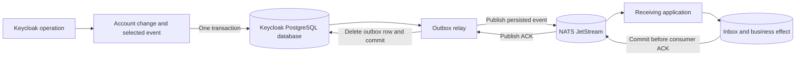

# Architecture

## Transactional capture

The bridge makes event capture part of Keycloak's database transaction. Publishing directly to NATS
cannot make that publication atomic with a database commit: publishing first can expose rolled-back
changes, while an in-memory after-commit queue can lose work on process failure.

The listener stores selected events in an outbox using Keycloak's existing persistence unit. Capture
failure marks the transaction for rollback. NATS availability is outside the request transaction, so
a broker outage allows account operations to continue while the database has capacity.

This boundary covers events that Keycloak actually sends to an enabled listener. Direct SQL changes,
external LDAP/identity-provider changes and custom integrations that emit no event are outside it.
External mutations are not made transactional by this bridge. Events are not backfilled after
installation or a period with the listener disabled. Keycloak error events can have a separate
transaction from the operation that failed.

Keycloak's custom JPA registration is unsupported upstream, and its event-listener SPI is classified
as internal. These integration points are an accepted architectural dependency with no upstream
stability guarantee. Each candidate server version needs runtime and upgrade validation as described
in [development](development.md#compatibility).

## Relay and failure boundaries

Each Keycloak node can run relay workers against the shared outbox. A worker locks a committed row,
publishes it, and deletes it only after the expected stream acknowledges acceptance. PostgreSQL row
locking with `SKIP LOCKED` coordinates workers without a separate leader or lease service. A failed
node's work becomes available when its database locks are released.

Holding the transaction through publication simplifies ownership and crash recovery, at the cost of
occupying a database connection during bounded broker requests. Local commit notifications reduce
latency; periodic scans recover work after missed notifications, another node's failure or a restart.
Worker concurrency must leave database capacity for Keycloak requests.

There are two unavoidable gaps between durable systems:

| Failure point | Recovery |
| --- | --- |
| JetStream accepts an event before outbox removal commits | Republish the original ID, subject and payload. |
| A consumer commits its effect before its ACK reaches JetStream | Redeliver; the consumer's durable idempotency state prevents a repeated effect. |

Delivery is therefore **at least once**. JetStream's message-ID deduplication window helps with short
retries, but cannot replace consumer deduplication. The example commits an inbox ID and its database
effect together. HTTP calls, email and other external effects need their own idempotency or outbox.

## Retention and backpressure

Pending outbox events retry indefinitely. They have no age expiry, retry-count deletion or automatic
purge. Capture-policy changes affect future events; accepted events retain their original identity,
subject and bytes.

The publisher validates stream settings to reject configurations that can silently evict accepted
work. A full stream rejects new publications, which remain in PostgreSQL for retry. Durability still
depends on storage, replication and restricted administrative access; stream validation cannot
prevent an operator from deleting data or prove that replicas occupy independent failure domains.

Choose retention around the receiving applications:

- **WorkQueue:** competing workers share one logical consumer; an ACK removes the message.
  Unconsumed messages remain even before a consumer exists.
- **Limits:** independent applications can each receive an event through their own durable consumers.
  The owner must retain history until every required application has processed it.
- **Interest:** rejected because events can disappear when no matching consumer exists.

No finite storage budget can absorb an unlimited outage. Capacity, admission decisions and coordinated
recovery belong to the deployment owner; see [operations](operations.md).

## Ordering and event meaning

The bridge provides no global, per-realm or per-user ordering guarantee. Concurrent capture,
publication and retries can reorder events, even with one relay worker. Event timestamps are not
commit sequences.

User enablement is an observed state, not proof of a transition. Applications maintaining account or
authorization projections must reconcile with current Keycloak state so a delayed update cannot undo
a later disablement or deletion. Reliable ordered processing would require coordinated sequencing
through capture, publication and consumption; it is not an existing configuration option.

## Code map

| Area | Responsibility and source |
| --- | --- |
| Capture | [Listener](../extension/src/main/java/io/github/gbeaule/keycloaknats/DurableEventListener.java), [policy](../extension/src/main/java/io/github/gbeaule/keycloaknats/EventFilter.java) and [envelope](../extension/src/main/java/io/github/gbeaule/keycloaknats/EventEnvelope.java) |
| Outbox | [Schema migrations](../extension/src/main/resources/META-INF/nats-outbox-changelog.xml), [row claims](../extension/src/main/java/io/github/gbeaule/keycloaknats/OutboxRepository.java) and [relay](../extension/src/main/java/io/github/gbeaule/keycloaknats/OutboxRelay.java) |
| Transport | [Publisher](../extension/src/main/java/io/github/gbeaule/keycloaknats/JetStreamPublisher.java) and shared [NATS transport module](../nats-transport/src/main/java/io/github/gbeaule/keycloaknats) |
| Example receiver | [Inbox processing](../consumer-example/src/main/java/io/github/gbeaule/keycloaknats/consumer/InboxProcessor.java) and [worker](../consumer-example/src/main/java/io/github/gbeaule/keycloaknats/consumer/ConsumerWorker.java) |
| Verification | [Container integration tests](../integration-tests/src/test/java/io/github/gbeaule/keycloaknats) exercise the packaged provider and failure boundaries. |
