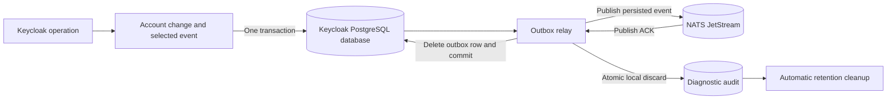

# Architecture

## Transactional capture

The bridge makes event capture part of Keycloak's database transaction. Publishing directly to NATS
cannot make that publication atomic with a database commit: publishing first can expose rolled-back
changes, while an in-memory after-commit queue can lose work on process failure.

The listener stores selected events in an outbox using Keycloak's existing persistence unit. Capture
failure marks the transaction for rollback. NATS availability is outside the request transaction, so
a broker outage allows account operations to continue while the database has capacity.

Callbacks freeze selected event data and publication policies without taking counter locks. The
transaction's prepare phase allocates sequences and persists the batch before the database commits.
Nested error-event transactions can therefore finish before their caller prepares. Counters are
acquired in a consistent order across users; each user's callback order within a transaction is
preserved. Separate transactions receive positions in preparation/commit order. Database capture
time is recorded during persistence, and failed preparation rolls back the owning transaction.

Counters survive user deletion and outbox draining. They also point to each user's earliest pending
event. Capture and resolution update this indexed head atomically with outbox changes, so claims
skip blocked histories. Counter locks cover short database work and are never held during broker
requests. Event identity, payload and captured policy stay immutable; sequence allocation and queue
progress are durable state written explicitly by the repositories.

For supported admin requests, affected-user identity comes from Keycloak's routed `user-id`
parameter after matching the request to the event's realm and resource. Capture resolves this ID
once for filtering, message metadata and ordering. Without matching request context, only an
unambiguous direct user path supplies an ID; ambiguous nested events remain independent.

This boundary covers events that Keycloak actually sends to an enabled listener. Direct SQL changes,
external LDAP/identity-provider changes and custom integrations that emit no event are outside it.
External mutations are not made transactional by this bridge. Events are not backfilled after
installation or a period with the listener disabled. Keycloak error events can have a separate
transaction from the operation that failed.

`JpaEntityProvider` registers the entities and initializes the schema through Liquibase. Keycloak
marks this mechanism [unsupported](https://www.keycloak.org/docs/26.7.4/server_development/#_extensions_jpa)
and classifies the event-listener SPI as internal. These dependencies require runtime and restart
validation for each candidate server version; see [development](development.md#compatibility).
Replacing JPA registration would require preserving capture in Keycloak's database transaction.

## Relay and failure boundaries

Each Keycloak node runs a bounded relay pool against the shared outbox. Only a user's earliest
unresolved event can be attempted. A delayed retry or another worker's lock cannot make its successor
eligible. Userless events remain independent. PostgreSQL row locks coordinate workers without a
leader or lease service; a failed node's work becomes available when those locks are released.

Before sending, the relay commits publication intent, then reacquires the unchanged eligible head.
It retains that row lock through the broker request and resolution transaction. Confirmed NATS
acceptance followed by committed outbox removal ends the extension's publication responsibility.

Holding the transaction through publication simplifies ownership and crash recovery, at the cost of
occupying a database connection during bounded broker requests. Local commit notifications reduce
latency; periodic scans recover work after missed notifications, another node's failure or a restart.
Worker concurrency must leave database capacity for Keycloak requests.

A timeout or failed database commit can leave an accepted original whose acknowledgement was lost.
Retries preserve its ID, subject and payload. The extension guarantees the sequence of publication
work, not duplicate-free broker history or downstream processing order. JetStream deduplication
helps with short retries; applications still own their idempotency.

## Retention and backpressure

Pending events retry indefinitely by default. Explicit event policies may allow discard by age,
failed attempts, or either limit. Age starts at database capture time, independently of the source
event timestamp. Policy snapshots survive filter reloads, which affect future captures only.

Fair expiry scans share the relay's bounded work allowance and can discard queued successors or
delayed retries without contacting NATS. Discard inserts metadata-only diagnostics and removes the
original atomically. A committed discard releases that sequence position without publishing a
replacement, tombstone or control message. If publication intent was recorded, the audit conservatively
reports an unknown outcome: discard cannot retract an accepted or in-flight original.

A failed row resolution backs off through a separate transaction that checks the original version.
Both relay scans respect this cooldown, allowing other users to progress while the original continues
to block its own successors. Database failures do not consume the publication-failure allowance.
Workers also apply a separate exponential failure cooldown that capture notifications cannot bypass.

An independent worker removes diagnostic history after seven days by default. Cleanup uses bounded
transactions and works during broker outages; retention zero makes history eligible on the next
pass. Cleanup never deletes pending originals or durable per-user counters. Shutdown stops new claims
and allows bounded draining; restart discovers unresolved database state.

The publisher validates stream settings to reject configurations that can silently evict accepted
work. A full stream rejects new publications, which remain in PostgreSQL for retry. Durability still
depends on storage, replication and restricted administrative access; stream validation cannot
prevent an operator from deleting data or prove that replicas occupy independent failure domains.

Choose retention around the receiving applications:

- **WorkQueue:** competing workers share one logical consumer; an ACK removes the message.
  Unconsumed messages remain even before a consumer exists.
- **Limits:** independent applications can each receive an event through their own durable consumers.
  The owner must retain history until every required application has processed it.
- **Interest:** rejected because events can disappear when no matching consumer exists.

No finite storage budget can absorb an unlimited outage. Capacity, admission decisions and coordinated
recovery belong to the deployment owner; see [operations](operations.md).

## Ordering and event meaning

Capture assigns monotonically increasing positions per affected `(realmId, userId)`, including
recognized nested user resources. The admin actor is never substituted for the target. Events
without confident user attribution do not share an unknown-user queue or allocate counter rows.

Publishing positions 10 and 12 after discarding 11 is valid. Subscribers may filter subjects and must
not wait for absent sequence values. No full-feed subscription or special receiver library is needed.
After an ambiguous discard, a late original or duplicate may still appear in NATS.

User enablement is an observed state, not proof of a transition. Applications maintaining account or
authorization projections must reconcile with current Keycloak state so a delayed update cannot undo
a later disablement or deletion. Receiving applications remain responsible for their processing order.

## Code map

| Area | Responsibility and source |
| --- | --- |
| Capture | [Listener](../extension/src/main/java/io/github/gbeaule/keycloaknats/DurableEventListener.java), [policy](../extension/src/main/java/io/github/gbeaule/keycloaknats/EventFilter.java) and [envelope](../extension/src/main/java/io/github/gbeaule/keycloaknats/EventEnvelope.java) |
| Outbox | [Initial schema](../extension/src/main/resources/META-INF/nats-outbox-changelog.xml), [row claims](../extension/src/main/java/io/github/gbeaule/keycloaknats/OutboxRepository.java) and [relay](../extension/src/main/java/io/github/gbeaule/keycloaknats/OutboxRelay.java) |
| Transport | [Publisher](../extension/src/main/java/io/github/gbeaule/keycloaknats/JetStreamPublisher.java) and shared [NATS transport module](../nats-transport/src/main/java/io/github/gbeaule/keycloaknats) |
| Operations | [Lifecycle](../extension/src/main/java/io/github/gbeaule/keycloaknats/DurableEventListenerFactory.java), [publication metrics](../extension/src/main/java/io/github/gbeaule/keycloaknats/RelayMetrics.java), [audit cleanup](../extension/src/main/java/io/github/gbeaule/keycloaknats/AuditCleanup.java) and [read-only reports](../consumer-example/src/main/java/io/github/gbeaule/keycloaknats/consumer/OutboxReport.java) |
| Example receiver | [Inbox processing](../consumer-example/src/main/java/io/github/gbeaule/keycloaknats/consumer/InboxProcessor.java) and [worker](../consumer-example/src/main/java/io/github/gbeaule/keycloaknats/consumer/ConsumerWorker.java) |
| Verification | [Container integration tests](../integration-tests/src/test/java/io/github/gbeaule/keycloaknats) exercise the packaged provider and failure boundaries. |
