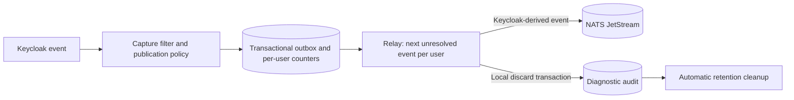

# Per-user publication ordering and local discard

Status: implementation plan. These documents do not mean the feature is implemented.

The extension captures selected Keycloak events, persists them transactionally and publishes them
to NATS JetStream. It owns event selection, publication order, retry and pre-publication discard.
Its responsibility ends at confirmed NATS acceptance and committed outbox resolution. Receiving
applications, their databases, processing order and failure handling are outside this feature.

Only messages derived from captured Keycloak events are published. Dropping an event does not
create a replacement message, audit event, tombstone or control notice in NATS.

## Agreed scope

- Extend the existing filter file with one publication policy per event. Default to indefinite
  retry; discard requires explicit configuration by maximum age, failed attempts, or either limit.
- Resolve policy at capture and persist it internally. Reloads affect future captures only.
- Measure expiry from database capture time. Accepted NATS messages are not subsequently expired
  or recalled by this policy.
- Coordinate publication by affected `(realmId, userId)` across Keycloak nodes. Include recognized
  nested user admin resources; never use the admin actor as the target.
- An unresolved event blocks later publication attempts for that user, while other users progress.
  A committed local discard releases that position without publishing anything in its place.
- Keep metadata-only discard diagnostics in the Keycloak PostgreSQL database. Automatically purge
  them after seven days, configurable; no export or manual draining is required.
- This extension is unreleased. Update initial schemas and the event contract directly. Do not
  implement old-data migration, dual formats or mixed-version rollout.

The existing optional `consumer-example` module is a separate program, not a provider dependency.
These plans add no consumer framework or application-processing feature. Integration tests may
read NATS messages to verify the publisher; that does not make consumption a runtime responsibility.

## Publication contract

Capture gives each attributable user's accepted events a monotonically increasing sequence under
that user's database lock. Transactions that roll back leave no captured event. Events without a
confidently resolved user remain independent; they do not share an unknown-user queue or allocate
per-event ordering-counter rows.

A worker starts the next pending event for a user only after all lower captured positions have
resolved through confirmed publication or committed policy-authorized discard. Retry backoff and
another worker's lock cannot make a successor eligible. Broker requests must not hold the capture
counter lock needed by a Keycloak request.

Ordering metadata is descriptive, not a contiguous-delivery protocol. For example, publishing
sequences 10 and 12 after locally discarding 11 is valid. A subscriber may also filter subjects.
There are no full-feed requirements, skip notices or requirements to wait for absent sequence values.

This guarantees the extension's sequencing of publication work. It does not guarantee consumer
processing order or a duplicate-free broker history. A publish timeout can leave an accepted or
in-flight original whose acknowledgement was lost. If policy allows abandoning that original,
the local record must say its publication outcome is unknown. It must not claim the message never
reached NATS. A late original or duplicate may still be observed; no database lock recalls bytes
already sent. Tests and documentation must preserve this limit instead of claiming unconditional
chronological receipt after an ambiguous discard.

## Architecture and storage

| Data | Location and lifecycle |
| --- | --- |
| Pending original | Keycloak outbox; remove after confirmed publication or committed local discard. |
| Discard audit | Separate extension table in Keycloak PostgreSQL; seven-day retention from committed discard. |
| Ordering counter | One small record per attributable user; survives outbox draining and user deletion to avoid resetting sequence identity. |
| Aggregate metrics | Prometheus-compatible measurements; no event/user IDs as labels and no replacement event publication. |

A discard transaction inserts its diagnostic record and removes the pending original atomically.
No NATS operation is required to finalize discard or to make the audit eligible for cleanup.
Cleanup uses bounded transactions and never deletes pending outbox rows or sequencing counters.
Audit retention zero means no diagnostic history beyond the next cleanup pass after commit.

Audits answer operator questions: which captured event was abandoned, under which rule, why and
when, and whether earlier publication attempts had an uncertain outcome. They are not an alternate
business-event feed or replay store. A deletion event requiring reliable publication belongs under
a retain policy; an audit record is not a delivery substitute.

Seven-day audit cleanup bounds historical diagnostics, not all storage. Protected pending events
can accumulate during an outage, and per-user counters remain required state. Monitor those
separately and do not claim that removing audit history removes every durability obligation.

## Phase index

| Phase | Deliverable | Prerequisite |
| --- | --- | --- |
| [1. Policy and contract](01-contracts-and-policy.md) | Extended filter, internal resolved policy and event ordering metadata | This index |
| [2. Capture](02-transactional-capture.md) | Transactional sequencing and fresh-install persistence | Phase 1 |
| [3. Relay](03-ordered-relay-and-discard.md) | Per-user publication selection and retry ownership | Phase 2 |
| [4. Local expiry and discard](04-expiry-and-local-discard.md) | Atomic discard, audit and release of blocked publication | Phases 1–3 |
| [5. Audit retention](05-audit-retention-and-cleanup.md) | Automatic bounded diagnostic cleanup | Phase 4 |
| [6. Operations](06-operations-and-integration.md) | Producer-only wiring, inspection, metrics and documentation | Phases 1–5 |
| [7. Verification](07-system-verification.md) | Concurrency, crash, discard and retention evidence | Phases 1–6 |

## Agent handoff instructions

Read the index, assigned phase and live code before editing. Preserve unrelated working-tree
changes. Each phase includes its own tests; do not defer transaction correctness to a final manual
check. Phases are internal implementation milestones, not independently deployable guarantees.

Keep exact behavior in code, schemas and executable tests. Return changed entry points, actual
validation commands/results and unresolved limitations with each handoff. Do not add consumer
processing, control subjects or an audit publisher to solve a source-side implementation problem.
Use the repository's validation scripts; report missing prerequisites honestly.

## Platform boundary

A NATS publish acknowledgement confirms storage, not downstream receipt or processing, and a
publication timeout can have an uncertain outcome. See the official
[publishing contract](https://docs.nats.io/learn/jetstream/publishing).
