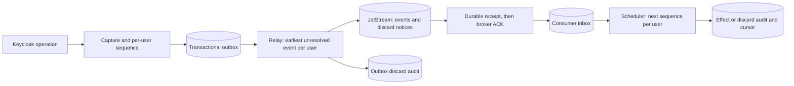

# Per-user ordering and configurable discard

Status: implementation plan; none of the phases below is implemented by these documents.

This feature gives each captured user's events a durable sequence and applies their downstream
effects in that sequence. Different users can progress independently. Explicit per-event policies
may abandon stale or repeatedly failing events without leaving an unexplained sequence gap.

These documents describe the intended architecture and acceptance criteria for implementation
agents. Once implemented, code, schemas and tests are the source of truth for exact behavior.

## Agreed scope

- This extension is unreleased. Change initial database schemas and the unreleased event contract
  directly; do not implement old-data migration, backfill, dual formats or mixed-version rollout.
  Fresh-install schema creation remains necessary. Do not erase a developer's existing database
  automatically.
- Extend the existing capture-filter file; do not introduce a second operator policy file.
- Support separate outbox and consumer rules, defaulting to retry indefinitely without expiry.
- Explicit discard rules may specify maximum age, maximum failed attempts, or both. Either reached
  threshold authorizes discard. Keep audit metadata, not a replayable discarded payload.
- Measure both stages' age from durable capture. Resolve and persist policy at capture; reloads
  affect future events only.
- Isolate blocked processing by user, not by a fixed hash partition.
- Ordered consumers ingest the complete feed, including discard notices. Business filters run
  locally after durable receipt; event-type broker filters cannot omit part of a user's sequence.
- Include recognized nested user admin resources, such as role mappings and credentials. Never
  substitute the administrator's identity for the affected user's identity.

## Guarantee and limits

The ordering key represents `(realmId, affectedUserId)`. Under that key, successful capture
transactions allocate consecutive sequence numbers starting at 1. Multiple events in one
transaction follow listener invocation order. Concurrent transactions acquire a per-user database
lock to establish their order; timestamps are descriptive and do not decide sequencing.

For one logical consumer, a sequence can become terminal only once as applied, discarded or
locally ignored. Sequence `n + 1` cannot become terminal until `n` does. Applying an event, recording
its terminal result and advancing the consumer cursor share a database transaction. External side
effects still need an application outbox or their own idempotency.

This is an ordered-effects guarantee. Raw deliveries may be duplicated or arrive out of order.
Capture includes only events actually emitted to and accepted by this listener. Observed account
state can still require reconciliation; sequence numbers do not make observations authoritative
business revisions.

Events without a confidently resolved user get their own singleton ordering key, with sequence 1.
They never share an `unknown-user` queue. User deletion does not reset sequence state, and user IDs
are scoped by realm.

## Architecture

The receiver has two independent stages. Ingestion commits the complete message to its database
before ACKing JetStream. Processing later claims one user's next sequence. A slow or failing handler
therefore does not prevent receipt and processing of other users' events. After receipt ACK, the
consumer database owns the delivery obligation; inbox capacity and backup are part of durability.

The relay retains unresolved heads, including heads waiting for retry, and skips entire blocked
users when selecting work. Capture counters and relay ownership must use separate rows so a broker
request cannot hold the sequence lock needed by a Keycloak request.

Discarding an outbox event commits an audit and replaces its pending publication obligation with a
small, durable discard notice for the same ordering key and sequence. The notice has its own
transport identity. Publish and acknowledge it before resolving that relay head. Notices never
expire or recursively discard. During a broker outage the payload can be removed, but the notice
still waits for publication; the design does not promise zero backlog during an outage.

An original publication may have succeeded before its acknowledgement was lost. A consumer may
therefore receive both the original and its discard notice. They are two representations of one
sequence, not two effects. The first committed terminal result wins: a notice cannot undo an
already-applied effect, and a late original cannot resurrect a discarded sequence. A producer audit
records abandonment of publication, not proof that no receiving application ever applied the event.

## Shared contract decisions

Phase 1 encodes these decisions in executable types, schemas and fixtures. Later phases consume
that contract instead of independently inventing field names.

| Concern | Planned contract |
| --- | --- |
| Business routing | Preserve current user/admin subject shapes. |
| Discard routing | `<prefix>.<realmToken>.control.discard`, inside the same stream and consumer feed. |
| Business schema | Revise the unreleased `event-v1.schema.json` and its existing schema identifier. |
| Notice schema | Add `discard-v1.schema.json`, `urn:keycloak-nats:discard:v1`, type `io.keycloak.delivery.discard`. |
| Metadata | Add `data.delivery` to business events; use the same delivery structure in notices. |
| Delivery structure | `capturedAt`, `ordering`, `policyId`, `ruleId`, `outbox`, `consumer`. |
| Ordering | `scope` (`user` or `event`), `key`, and `sequence` as a positive decimal string backed by a checked signed 64-bit integer. |
| Key encoding | `u.<base64url realm ID>.<base64url user ID>`; singleton keys use `e.<original event UUID>`. No hashing collisions or ambiguous concatenation. |
| Policy provenance | `policyId` is SHA-256 of the applied filter-file bytes; `ruleId` identifies the match separately. Use a stable built-in default identity when no file is configured. |
| Resolved stage policy | `action: retry` with no thresholds, or `action: discard` with `maxAgeSeconds`, `maxFailures`, or both. |
| Original identity | Persist source, UUID and exact serialized-byte hash; reuse original bytes and UUID on publication retries. |
| Notice identity | A distinct UUID and immutable bytes persisted when the discard decision commits; retries reuse that UUID. |
| Notice contents | Original source/ID/subject/payload hash, delivery metadata, reason, decision time and failed-attempt count; no original business payload. |
| Terminal reasons | Distinguish applied, local-filter ignore, consumer expiry/failure discard, and producer discard notice. |

No broker TTL or eviction policy implements this feature. Keep the existing stream safety checks.
Unpublished discard notices and unresolved consumer sequence gaps cannot be removed on age alone.

## Phase index

Execute phases in order unless their stated prerequisites permit narrower independent work. Each
phase owns its focused tests; the last phase proves the composed behavior. These are internal
implementation milestones, not individually deployable releases of the ordering guarantee.

| Phase | Deliverable | Prerequisite |
| --- | --- | --- |
| [1. Contracts and policy](01-contracts-and-policy.md) | Extended filter, shared delivery contract, schemas and fixtures | This index |
| [2. Transactional capture](02-transactional-capture.md) | Per-user sequencing and fresh-install persistence | Phase 1 |
| [3. Ordered relay and discard](03-ordered-relay-and-discard.md) | Per-user head selection, expiry and durable notices | Phases 1–2 |
| [4. Durable consumer ingestion](04-durable-consumer-ingestion.md) | Database receipt before ACK and complete-feed validation | Phase 1; phase 3 fixtures for integration |
| [5. Per-user processing](05-per-user-processing.md) | Independent schedulers, policy enforcement and atomic outcomes | Phases 1 and 4; phase 3 for full integration |
| [6. Operations and integration](06-operations-and-integration.md) | Runtime wiring, audit inspection, metrics, examples and documentation | Phases 1–5 |
| [7. System verification](07-system-verification.md) | Failure, concurrency, compatibility and performance evidence | Phases 1–6 |

## Instructions for implementation agents

1. Read this index, the assigned phase and applicable repository instructions. Inspect actual code
   before editing; filenames below identify starting points, not immutable implementation APIs.
2. Preserve unrelated working-tree changes. At planning time, tests in `extension` and
   `nats-transport` already contained local changes; recheck the live status.
3. Implement the phase's production changes and meaningful tests together. Do not declare a
   guarantee based only on mocks of PostgreSQL locks, broker ACKs or transaction failures.
4. Use the existing Java 21/Maven/Python validation entry points. Commands run from the repository
   root; use `python` on Windows. Record missing prerequisites instead of reporting skipped checks
   as passing.
5. Hand off a short summary containing changed contract/code locations, commands and results,
   unresolved issues, and any contract changes downstream phases must adopt. Do not leave silent
   TODOs in a path claimed to preserve ordering or discard safely.
6. Keep ordinary documentation architectural and concise. Put detailed names, validation and state
   transitions in code, schemas and tests. These plans are implementation guidance, not a second
   permanent implementation specification.

## Boundaries for this release

Use complete retained history starting at sequence 1, or the existing durable inbox/cursors on
restart. Bootstrapping a new consumer from partial history, resetting sequence state, replaying
discarded payloads and arbitrary event-type broker filtering are outside this implementation.
WorkQueue retention serves one logical application; independent applications need complete retained
history with separate durables, typically using Limits retention.

Isolation is logical, not unlimited capacity: global database/broker failure or exhausted storage
can still stop everyone. A permanently failing retain-policy event intentionally blocks its user.
Do not add an implicit timeout that skips a missing sequence to make a test pass.

## Relevant platform references

NATS describes why concurrent consumers and redeliveries can complete work out of order in its
[ordered-consumption discussion](https://nats.io/blog/orbit-partitioned-consumer-groups/). This plan
uses a durable per-user scheduler rather than shared partitions.

PostgreSQL documents [transaction-scoped row locking and savepoint behavior](https://www.postgresql.org/docs/current/explicit-locking.html).
Ordinary [database sequences](https://www.postgresql.org/docs/current/functions-sequence.html) do
not roll back allocation, so they cannot supply the consecutive committed per-user sequence needed
by this protocol. Verify the actual lock queries on every PostgreSQL version in the repository matrix.
